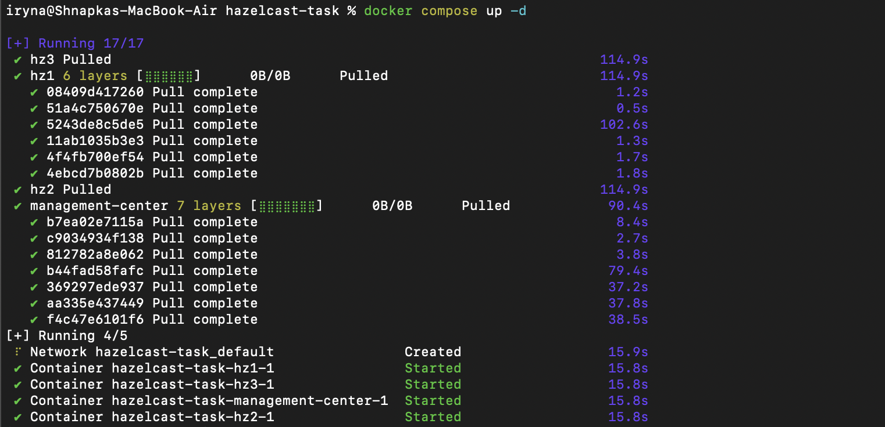
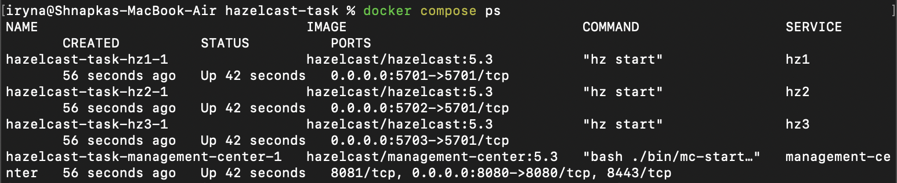
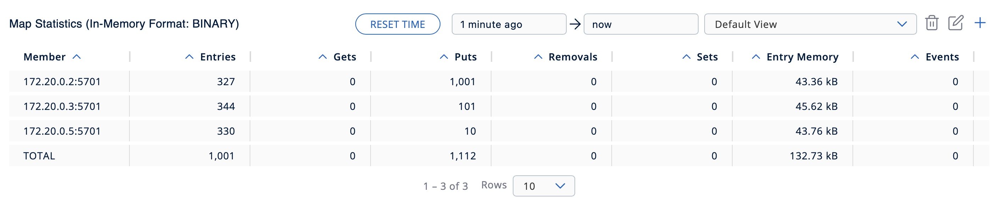
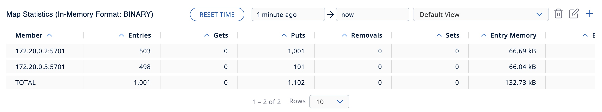
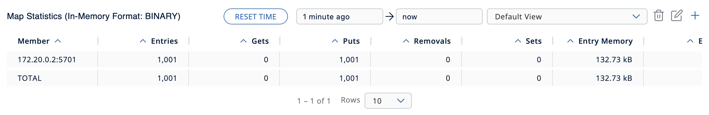
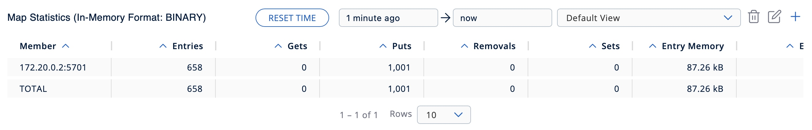

# Hazelcast-Distributed-Map — Lab 2
Розгортання і робота з distributed in-memory data structures на основі Hazelcast: Distributed Map

## Part 1 — Installation and Setup

Hazelcast cluster was deployed using Docker Compose with 3 nodes and Management Center.

**Steps:**
1. Install Docker Desktop
2. Create `docker-compose.yml` with 3 Hazelcast nodes and Management Center
3. Run `docker compose up -d`
4. Install Python client: `pip install hazelcast-python-client`

Management Center is available at: http://localhost:8080




## Part 2 — 3-Node Cluster Configuration

Three Hazelcast nodes were configured as Docker containers united in a single cluster named `dev`. All nodes automatically discover each other within the Docker network and form a cluster, which can be verified in Management Center where all 3 members are visible.


## Part 3 — Fault Tolerance Experiments

A 3-node Hazelcast cluster was used to observe how the distributed map behaves when nodes fail. The map `my-map` was populated with **1,001 entries** via `map_demo.py`, evenly distributed across all three nodes (~330 entries each).



***

### Experiment 1 — Stopping 1 Node

One node was stopped using:
```bash
docker stop hazelcast-task-hz1-1
```

The cluster automatically rebalanced the data across the 2 remaining nodes (503 and 498 entries respectively). No data was lost — TOTAL remained **1,001**.

**Observation:** Hazelcast detects the node failure and redistributes partitions to surviving nodes with zero data loss.




***

### Experiment 2 — Sequential Stop of 2 Nodes

The second node was then stopped:
```bash
docker stop hazelcast-task-hz2-1
```

All data migrated to the single remaining node. TOTAL remained **1,001**.

**Observation:** Sequential node failures are handled gracefully — after each shutdown the cluster has enough time to replicate and rebalance data before the next failure occurs.



***

### Experiment 3 — Simultaneous Stop of 2 Nodes

All nodes were restarted first:
```bash
docker start hazelcast-task-hz1-1 hazelcast-task-hz2-1 hazelcast-task-hz3-1
```

Then two nodes were stopped simultaneously:
```bash
docker stop hazelcast-task-hz1-1 hazelcast-task-hz2-1
```

This resulted in partial data loss — TOTAL dropped to **658** out of 1,001 entries (~34% lost).

**Observation:** When two nodes fail simultaneously, the cluster cannot replicate data fast enough, leading to significant data loss. This is a known limitation of the default Hazelcast configuration with `backup-count=1` — only one backup copy exists per partition, so losing two nodes at once destroys both the primary and its backup.


